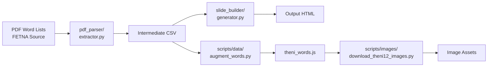
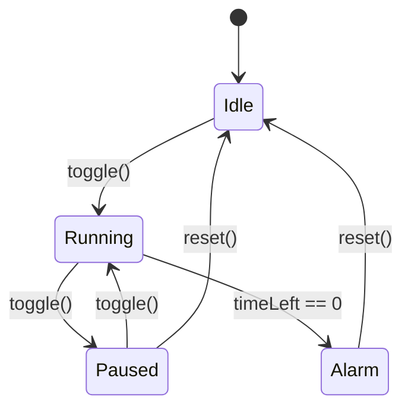

# TamilTheni Architecture Document

**Version:** 1.0  
**Last Updated:** January 2026  
**Author:** Peoria Tamil School Development Team

---

## Table of Contents

1. [Executive Summary](#executive-summary)
2. [System Overview](#system-overview)
3. [Architecture Diagram](#architecture-diagram)
4. [Frontend Architecture](#frontend-architecture)
5. [Data Architecture](#data-architecture)
6. [Python Tooling Pipeline](#python-tooling-pipeline)
7. [Deployment Architecture](#deployment-architecture)
8. [Module Deep Dives](#module-deep-dives)
9. [Design System](#design-system)
10. [Development Workflow](#development-workflow)
11. [Security Considerations](#security-considerations)
12. [Future Considerations](#future-considerations)

---

## Executive Summary

TamilTheni is a Tamil language learning web application designed for the FETNA Tamil Theni Competition. The application is a static single-page application (SPA) hosted on GitHub Pages, featuring five distinct learning modules targeting different Tamil language skills including vocabulary, sentence construction, translation, and word discovery.

### Key Architectural Decisions

| Decision | Rationale |
|----------|-----------|
| **Static Site** | Zero server costs, simple deployment via GitHub Pages |
| **Vanilla JavaScript** | No build step required, minimal dependencies, fast load times |
| **IIFE Module Pattern** | Browser-compatible namespacing without bundler complexity |
| **CSS Design Tokens** | Centralized design system for consistent styling |
| **Python Tooling** | Offline data processing pipeline for content generation |

---

## System Overview

```
┌─────────────────────────────────────────────────────────────────────────────┐
│                              TamilTheni System                               │
├─────────────────────────────────────────────────────────────────────────────┤
│                                                                              │
│  ┌─────────────────────┐    ┌─────────────────────┐    ┌──────────────────┐ │
│  │   Content Pipeline  │───▶│   Static Web App    │───▶│   GitHub Pages   │ │
│  │   (Python Scripts)  │    │   (HTML/CSS/JS)     │    │   (Deployment)   │ │
│  └─────────────────────┘    └─────────────────────┘    └──────────────────┘ │
│           │                          │                                       │
│           ▼                          ▼                                       │
│  ┌─────────────────────┐    ┌─────────────────────┐                         │
│  │   PDF Word Lists    │    │   External APIs     │                         │
│  │   (FETNA Source)    │    │   (Wikipedia, AI)   │                         │
│  └─────────────────────┘    └─────────────────────┘                         │
│                                                                              │
└─────────────────────────────────────────────────────────────────────────────┘
```

---

## Architecture Diagram

```mermaid
graph TB
    subgraph "User Interface Layer"
        INDEX[index.html<br/>Portal Home]
        T1[theni1.html<br/>Word Identification]
        T2[theni2.html<br/>Sentence Building]
        T34[theni34.html<br/>Translation]
        T5[theni5.html<br/>Word Discovery]
    end

    subgraph "JavaScript Module Layer"
        CONFIG[config.js<br/>App Configuration]
        UTILS[utils.js<br/>Shared Utilities]
        LAYOUT[layout.js<br/>UI Components]
        TIMER[timer.js<br/>Timer Engine]
        AUDIO[audio_manager.js<br/>TTS Handler]
        
        T1JS[theni1.js]
        T2JS[theni2.js]
        T34JS[theni34.js]
        T5JS[theni5.js]
    end

    subgraph "Data Layer"
        WORDS[theni_words.js<br/>800 Words]
        T5WORDS[theni5_words.js<br/>50 Clues]
    end

    subgraph "CSS Design System"
        TOKENS[tokens.css<br/>Design Tokens]
        STYLE[style.css<br/>Shared Styles]
        T1CSS[theni1.css]
        T2CSS[theni2.css]
        T34CSS[theni34.css]
        T5CSS[theni5.css]
    end

    subgraph "External Services"
        WIKI[Wikipedia API<br/>Images]
        GEMINI[Gemini AI<br/>Sentence Generation]
        TTS[Web Speech API<br/>Text-to-Speech]
    end

    INDEX --> T1 & T2 & T34 & T5
    
    T1 --> T1JS --> CONFIG & UTILS & LAYOUT & TIMER & AUDIO
    T2 --> T2JS --> CONFIG & UTILS & LAYOUT & TIMER
    T34 --> T34JS --> CONFIG & UTILS & LAYOUT & TIMER
    T5 --> T5JS --> CONFIG & UTILS & LAYOUT & TIMER

    T1JS & T2JS --> WORDS
    T5JS --> T5WORDS
    
    T1JS & T2JS --> WIKI
    T2JS --> GEMINI
    T1JS --> TTS
    
    T1 & T2 & T34 & T5 --> TOKENS & STYLE
    T1 --> T1CSS
    T2 --> T2CSS
    T34 --> T34CSS
    T5 --> T5CSS
```



---

## Frontend Architecture

### Directory Structure

```
docs/                           # GitHub Pages root
├── index.html                  # Portal landing page
├── theni1.html                 # Theni 1: Word identification
├── theni2.html                 # Theni 2: Sentence building
├── theni34.html                # Theni 3 & 4: Translation practice
├── theni5.html                 # Theni 5: Word discovery
├── construction.html           # Under construction placeholder
└── assets/
    ├── css/
    │   ├── tokens.css          # Design system variables
    │   ├── style.css           # Shared component styles
    │   ├── index.css           # Portal page styles
    │   ├── theni1.css          # Theni 1 specific styles
    │   ├── theni2.css          # Theni 2 specific styles
    │   ├── theni34.css         # Theni 3 & 4 specific styles
    │   └── theni5.css          # Theni 5 specific styles
    ├── js/
    │   ├── config.js           # Application configuration
    │   ├── utils.js            # Shared utility functions
    │   ├── layout.js           # Shared UI component injection
    │   ├── timer.js            # Timer with audio feedback
    │   ├── audio_manager.js    # Text-to-speech management
    │   ├── theni1.js           # Theni 1 module logic
    │   ├── theni2.js           # Theni 2 module logic
    │   ├── theni34.js          # Theni 3 & 4 module logic
    │   └── theni5.js           # Theni 5 module logic
    ├── data/
    │   ├── theni_words.js      # Word list (800 entries)
    │   └── theni5_words.js     # Theni 5 clue words
    └── images/
        └── theni12/            # Cached word images
```

### JavaScript Module Pattern

All JavaScript modules use the **IIFE (Immediately Invoked Function Expression)** pattern to avoid global namespace pollution while maintaining browser compatibility without a build step.

```javascript
// Module Pattern Structure
(function () {
    'use strict';
    
    // Private state
    let privateVariable = 0;
    
    // Private functions
    function privateFunction() { ... }
    
    // Public API (exported to window)
    window.publicFunction = function() { ... };
    
    // Initialize on DOM ready
    document.addEventListener('DOMContentLoaded', init);
})();
```

### Shared Modules

| Module | Purpose | Key Exports |
|--------|---------|-------------|
| `config.js` | Centralized configuration | `TheniConfig` (timer durations, API endpoints) |
| `utils.js` | Utility functions | `TheniUtils` (shuffle, progress, localStorage) |
| `layout.js` | UI component injection | `TheniLayout` (control panel, timer, navigation) |
| `timer.js` | Countdown timer engine | `TheniTimer` (start, stop, reset, audio) |
| `audio_manager.js` | Text-to-Speech wrapper | `TheniAudio` (speak, mute, voice selection) |

### Page Module Responsibilities

#### Theni 1 (`theni1.js`) - Word Identification
- **Purpose:** Display image, user identifies Tamil word
- **Features:** Voice recognition, TTS pronunciation, category filtering
- **Dependencies:** SpeechRecognition API, TheniAudio, Wikipedia images

#### Theni 2 (`theni2.js`) - Sentence Building
- **Purpose:** Given 3 images, construct a Tamil sentence
- **Features:** AI-powered sentence generation via Gemini API
- **Dependencies:** Gemini API (requires API key), image caching

#### Theni 3 & 4 (`theni34.js`) - Translation Practice
- **Purpose:** Translate English sentences to Tamil
- **Features:** Difficulty levels (Theni 3 vs Theni 4), reveal answers
- **Dependencies:** Shared word data with translations

#### Theni 5 (`theni5.js`) - Word Discovery
- **Purpose:** Find target word using clue words
- **Features:** Configurable page ranges, 1-minute timer default
- **Dependencies:** Separate clue word dataset

---

## Data Architecture

### Word Data Schema (`theni_words.js`)

The application manages **800 words** with the following schema:

```javascript
{
  "id": 1,                          // Unique identifier
  "category": "Body Parts",          // English category name
  "category_ta": "உடல் பகுதிகள்",    // Tamil category name
  "difficulty": "D1",                // D1 (easier) or D2 (harder)
  "word_en": "ear",                  // English word
  "word_ta": "காது",                 // Tamil word
  "image_word": "ear",               // Image lookup key
  "sentence_en": "I have an <b>ear</b> infection.",   // English sentence
  "sentence_ta": "எனக்கு காதில் தொற்று உள்ளது.",      // Tamil translation
  "complexity": 2                    // Sentence complexity (1-3)
}
```

### Category Distribution

| Category | Word Count | Example Words |
|----------|------------|---------------|
| Body Parts | 40 | ear, nose, head, heart |
| Food & Groceries | ~40 | rice, milk, honey |
| Animals | ~40 | dog, cat, elephant |
| Nature | ~40 | tree, mountain, river |
| ... | ... | ... |

### Theni 5 Word Schema (`theni5_words.js`)

```javascript
{
  "id": 1,
  "answer": "தமிழ்",           // Target word to discover
  "clues": [                   // Array of 5-10 hint words
    "மொழி", "பண்பாடு", "இலக்கியம்"
  ]
}
```

### Image Storage Strategy

- **Location:** `docs/assets/images/theni12/`
- **Naming:** `{word_en}.jpg` (e.g., `ear.jpg`)
- **Fallback:** Wikipedia API fetch if local image missing
- **Caching:** Browser cache + JavaScript image cache object

---

## Python Tooling Pipeline

### Pipeline Overview



### Script Directory Structure

```
scripts/
├── images/                          # Image management
│   ├── download_theni12_images.py   # Bulk image downloader
│   ├── fix_bad_images.py            # Replace low-quality images
│   ├── check_missing_images.py      # Audit missing images
│   └── replace_theni12_image.py     # Single image replacement
├── data/                            # Data processing
│   ├── augment_words.py             # Enhance word data (sentences, etc.)
│   └── validate_and_fix.py          # Data validation and cleanup
└── agents/                          # Conversion tools
    ├── csv_to_html_agent.py         # CSV to HTML converter
    └── pdf_parse_agent.py           # PDF parsing orchestrator
```

### PDF Parser (`pdf_parser/`)

**Purpose:** Extract structured data from FETNA PDF word lists

**Components:**
- `extractor.py` - Main extraction logic using pdfplumber + pymupdf
- `theni5_extractor.py` - Specialized extractor for Theni 5 format

**Key Functions:**
```python
def extract_pdf_to_csv(pdf_path, output_csv_path):
    """
    Extracts tabular data from PDF using hybrid approach:
    - pdfplumber: Table structure detection
    - pymupdf: Accurate Tamil Unicode text extraction
    """
```

### Slide Builder (`slide_builder/`)

**Purpose:** Generate HTML slides from CSV data

**Components:**
- `generator.py` - HTML generation logic
- `template.html` - Base HTML template with placeholders

### Image Downloader (`scripts/images/download_theni12_images.py`)

**Image Sources (Priority Order):**
1. **Wikipedia** - Preferred for accuracy
2. **LoremFlickr** - Fallback for generic images
3. **Openverse** - Creative Commons images
4. **Pollinations AI** - AI-generated fallback (disabled by default)

**Usage:**
```bash
python scripts/images/download_theni12_images.py --force  # Re-download all
python scripts/images/download_theni12_images.py          # Only missing
```

---

## Deployment Architecture

### GitHub Pages Configuration

```yaml
# Deployment: docs/ folder on main/publish branch
Source: docs/
Branch: publish (primary), main
Custom Domain: None (uses github.io subdomain)
```

### CI/CD Pipeline (`.github/workflows/ci.yml`)

```yaml
name: CI
on:
  push:
    branches: [main, publish]
  pull_request:
    branches: [main, publish]

jobs:
  lint:
    runs-on: ubuntu-latest
    steps:
      - Checkout code
      - Setup Node.js 20
      - npm ci
      - npm run lint          # ESLint check
      - npm run format:check  # Prettier check
```

### Versioning Strategy

Cache busting is handled via query string versioning:

```html
<link rel="stylesheet" href="assets/css/style.css?v=21">
<script src="assets/js/theni1.js?v=21"></script>
```

**Version Bump Script:** `bump-version.sh`
```bash
#!/bin/bash
# Increments version number across all HTML files
```

---

## Module Deep Dives

### Timer Module (`timer.js`)

The timer is a sophisticated component with visual feedback and audio cues.



**Key Features:**
- Circular pie-chart visual (CSS conic-gradient)
- Configurable duration per module
- Tick sound on last 5 seconds
- Alarm sound with flashing visual
- Audio context unlock for mobile browsers

**Configuration:**
```javascript
const TheniConfig = {
    timerDurations: {
        theni1: 8,   // 8 seconds
        theni2: 20,  // 20 seconds
        theni3: 15,  // 15 seconds
        theni4: 40,  // 40 seconds
        theni5: 60   // 60 seconds (1 minute)
    }
};
```

### Layout Module (`layout.js`)

Provides consistent UI injection across all modules:

```javascript
TheniLayout.init({
    title: "Theni 1 Mastery",
    contentHTML: `<div class="control-row">...</div>`,
    timerDisplay: "00:08",
    injectNavigation: true
});
```

**Injected Components:**
1. **Control Panel** - Collapsible settings panel
2. **Circular Timer** - Visual countdown timer
3. **Navigation** - First/Prev/Counter/Next/Last buttons

### Audio Manager (`audio_manager.js`)

Wraps the Web Speech Synthesis API for Tamil pronunciation:

```javascript
TheniAudio.speak("காது", "ta-IN");  // Pronounce Tamil word
```

**Voice Selection Priority:**
1. Google Tamil voice (highest quality)
2. Any Tamil voice
3. System default

---

## Design System

### CSS Custom Properties (`tokens.css`)

The design system provides ~100 CSS custom properties organized by category:

#### Color Palette
```css
:root {
    /* Primary Brand */
    --color-primary: #667eea;
    --color-secondary: #764ba2;
    
    /* Semantic */
    --color-success: #00b894;
    --color-warning: #fdcb6e;
    --color-error: #e74c3c;
    
    /* Neutral */
    --color-text: #2d3436;
    --color-bg: #f5f7fa;
}
```

#### Typography
```css
:root {
    --font-main: 'Outfit', 'Segoe UI', system-ui, sans-serif;
    --font-tamil: 'Noto Sans Tamil', 'Latha', 'Vijaya', sans-serif;
    
    --text-base: 1rem;      /* 16px */
    --text-xl: 1.25rem;     /* 20px */
    --text-3xl: 1.875rem;   /* 30px */
}
```

#### Spacing Scale
```css
:root {
    --space-1: 0.25rem;   /* 4px */
    --space-2: 0.5rem;    /* 8px */
    --space-4: 1rem;      /* 16px */
    --space-8: 2rem;      /* 32px */
}
```

### Component Styling Pattern

Each module has a dedicated CSS file that imports tokens and extends shared styles:

```css
/* theni1.css */
.voice-feedback {
    position: fixed;
    bottom: var(--space-8);
    background: var(--color-success);
    border-radius: var(--radius-lg);
    box-shadow: var(--shadow-lg);
    transition: var(--transition-base);
}
```

---

## Development Workflow

### Local Development

```bash
# Start development server
npm run dev              # Starts server on http://localhost:8888

# Or directly with Python
cd docs && python3 -m http.server 8888
```

### Code Quality

```bash
npm run lint             # Check JavaScript with ESLint
npm run lint:fix         # Auto-fix ESLint issues
npm run format           # Format with Prettier
npm run format:check     # Check formatting
```

### Data Pipeline

```bash
# 1. Extract words from PDF
python pdf_parser/extractor.py

# 2. Augment with sentences (if needed)
python scripts/data/augment_words.py

# 3. Download images
python scripts/images/download_theni12_images.py

# 4. Validate data integrity
python scripts/data/validate_and_fix.py
```

### Branching Strategy

| Branch | Purpose |
|--------|---------|
| `main` | Development branch |
| `publish` | Production deployment (GitHub Pages) |

---

## Security Considerations

### API Key Management

The Theni 2 module uses the Gemini AI API for sentence generation. The API key is:
- Stored client-side in localStorage
- Entered by user at runtime
- Not committed to repository

```javascript
// Theni 2 API key flow
saveApiKey(key) {
    localStorage.setItem('gemini_api_key', key);
}
```

> [!WARNING]
> Client-side API key storage is inherently insecure. Consider implementing a proxy server for production use.

### Content Security

- No user authentication required
- No sensitive data collection
- All content is educational and family-safe
- Images sourced from Wikipedia (Creative Commons)

---

## Future Considerations

### Potential Improvements

1. **Progressive Web App (PWA)**
   - Offline support via Service Worker
   - Installable on mobile devices

2. **Backend Integration**
   - Progress tracking across devices
   - Teacher/student accounts
   - Leaderboards

3. **Performance Optimization**
   - Image lazy loading
   - JavaScript code splitting
   - CDN for static assets

4. **Accessibility**
   - ARIA labels
   - Keyboard navigation
   - Screen reader support

5. **Testing**
   - Unit tests for JavaScript modules
   - E2E tests with Playwright
   - Visual regression tests

### Technical Debt

| Item | Priority | Notes |
|------|----------|-------|
| TypeScript migration | Medium | Improved type safety |
| Component extraction | Low | Reduce duplication in module files |
| Image optimization | High | Convert to WebP format |
| Test coverage | High | Currently no automated tests |

---

## Appendix

### External Dependencies

| Dependency | Version | Purpose |
|------------|---------|---------|
| ESLint | 9.18.0 | JavaScript linting |
| Prettier | 3.4.2 | Code formatting |
| pdfplumber | (Python) | PDF table extraction |
| pymupdf | (Python) | PDF text extraction |

### API Endpoints

| Service | Endpoint | Purpose |
|---------|----------|---------|
| Wikipedia | `en.wikipedia.org/w/api.php` | Image fetching |
| Gemini AI | `generativelanguage.googleapis.com/v1beta` | Sentence generation |

### File Size Analysis

| Directory | Size | Notes |
|-----------|------|-------|
| `docs/assets/data/` | ~390KB | Word lists (JSON-in-JS) |
| `docs/assets/images/` | ~50MB | Cached images |
| `docs/assets/js/` | ~100KB | Application logic |
| `docs/assets/css/` | ~30KB | Stylesheets |

---

*This document is maintained alongside the codebase. For updates, please modify `docs/ARCHITECTURE.md` and commit to the repository.*
