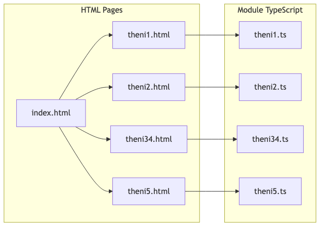
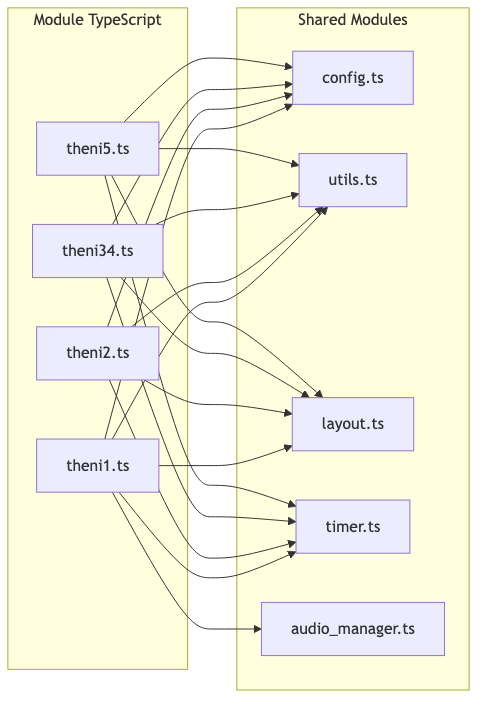
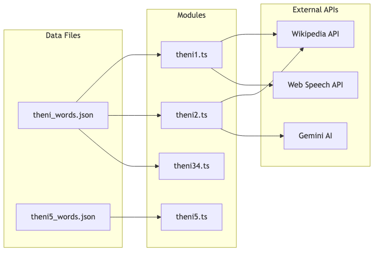

# TamilTheni Architecture Document

**Version:** 2.0  
**Last Updated:** January 2026  
**Author:** Peoria Tamil School Development Team

---

## Table of Contents

1. [Executive Summary](#executive-summary)
2. [System Overview](#system-overview)
3. [Architecture Diagram](#architecture-diagram)
4. [Frontend Architecture](#frontend-architecture)
5. [Data Architecture](#data-architecture)
6. [Python Tooling Pipeline](#python-tooling-pipeline)
7. [Deployment Architecture](#deployment-architecture)
8. [Module Deep Dives](#module-deep-dives)
9. [Agentic Architecture](#agentic-architecture)
10. [Design System](#design-system)
11. [Development Workflow](#development-workflow)
12. [Security Considerations](#security-considerations)
13. [Future Considerations](#future-considerations)

---

## Executive Summary

TamilTheni is a Tamil language learning web application designed for the FETNA Tamil Theni Competition. The application is a static single-page application (SPA) hosted on GitHub Pages, featuring five distinct learning modules targeting different Tamil language skills including vocabulary, sentence construction, translation, and word discovery.

### Key Architectural Decisions

| Decision           | Rationale                                                                |
| ------------------ | ------------------------------------------------------------------------ |
| **Vite**           | Modern, fast build tool with instant HMR and optimized production builds |
| **TypeScript**     | Static typing for better maintainability and error catching              |
| **JSON Data**      | Structured, interoperable data format separated from logic               |
| **CSS Modules**    | Component-scoped styling (via standard CSS imports)                      |
| **Python Tooling** | Offline data processing pipeline for content generation                  |

---

## System Overview

```
┌─────────────────────────────────────────────────────────────────────────────┐
│                              TamilTheni System                              │
├─────────────────────────────────────────────────────────────────────────────┤
│                                                                             │
│  ┌─────────────────────┐    ┌─────────────────────┐    ┌──────────────────┐ │
│  │   Content Pipeline  │───▶│    Vite Build       │───▶│   GitHub Pages   │ │
│  │   (Python Scripts)  │    │   (TS -> JS Bundle) │    │   (Deployment)   │ │
│  └─────────────────────┘    └─────────────────────┘    └──────────────────┘ │
│           │                          │                                      │
│           ▼                          ▼                                      │
│  ┌─────────────────────┐    ┌─────────────────────┐                         │
│  │   JSON Data Files   │    │   External APIs     │                         │
│  │   (src/data/*.json) │    │   (Wikipedia, AI)   │                         │
│  └─────────────────────┘    └─────────────────────┘                         │
│                                                                             │
└─────────────────────────────────────────────────────────────────────────────┘
```

---

## Architecture Diagram

### Application Layer



### Shared Infrastructure



### Data Flow



---

## Frontend Architecture

### Directory Structure

```
tamiltheni/
├── public/                  # Static assets (images, fonts) served efficiently
├── src/                     # Source code
│   ├── css/                 # Stylesheets modularized by page
│   ├── js/                  # TypeScript logic files
│   ├── data/                # JSON data files (Single Source of Truth)
│   └── types/               # TypeScript interface definitions
├── html/                    # HTML entry points for each module
├── test/                    # Test files
│   ├── bat/                 # Build Acceptance Tests
│   └── unit/                # Unit tests
├── documentation/           # Project documentation
│   ├── ARCHITECTURE.md      # This file
│   └── REQUIREMENTS.md      # Product requirements
├── index.html               # Main entry point
├── docs/                    # Production build output (GitHub Pages root)
```

### TypeScript Strategy

We use TypeScript to enforce data contracts and reduce runtime errors. Key interfaces include:

```typescript
// Word Data Structure
interface Word {
    id: number;
    category: string;
    word_en: string;
    word_ta: string;
    difficulty: 'D1' | 'D2';
    // ...other fields
}
```

The build process (`tsc && vite build`) transpiles this to optimized JavaScript bundles.

### Shared Modules

| Module              | Purpose                   | Key Exports           |
| ------------------- | ------------------------- | --------------------- |
| `config.ts`         | Centralized configuration | `config` object       |
| `utils.ts`          | Utility functions         | `Utils` class         |
| `layout.ts`         | UI component injection    | `Layout` class        |
| `timer.ts`          | Countdown timer engine    | `Timer` class         |
| `audio_manager.ts`  | Text-to-Speech wrapper    | `AudioManager` class  |
| `gemini_service.ts` | AI API Integration        | `GeminiService` class |

---

## Data Architecture

### JSON Data Files (`src/data/`)

Data is stored in standard JSON format, allowing easy manipulation by Python scripts and straightforward import by TypeScript.

- `theni_words.json`: Contains the main dataset of ~800 words.
- `theni5_words.json`: Contains the clue-based dataset for Theni 5.

### Word Data Schema (`theni_words.json`)

```json
[
    {
        "id": 1,
        "category": "Body Parts",
        "category_ta": "உடல் பகுதிகள்",
        "difficulty": "D1",
        "word_en": "ear",
        "word_ta": "காது",
        "image_word": "ear",
        "sentence_en": "I have an <b>ear</b> infection.",
        "sentence_ta": "எனக்கு காதில் தொற்று உள்ளது.",
        "complexity": 2
    }
]
```

### Image Storage Strategy

- **Location:** `public/assets/images/theni12/`
- **Naming:** `{word_en}.jpg` (e.g., `ear.jpg`)
- **Fallback:** Wikipedia API fetch if local image missing

---

## Python Tooling Pipeline

### Pipeline Overview


---

## Deployment Architecture

### GitHub Pages Configuration

```yaml
# Deployment: docs/ folder on publish branch
Source: docs/
Branch: publish (primary)
```

### Build Process

1. **Development**: `npm run dev` serves files from memory with hot replacement.
2. **Production**: `npm run build` runs `tsc` (type check) then `vite build`.
3. **Artifacts**: Minified JS/CSS and assets are output to `docs/`.

---

## Module Deep Dives

### Timer Module (`timer.ts`)

Configurable countdown timer with visual pie-chart representation and audio feedback.

### Layout Module (`layout.ts`)

Injects common UI elements (headers, navigation, sidebars) into each HTML page at runtime, ensuring consistency. It also manages the **Control Panel toggle** and **Global Keyboard Shortcuts** (including the Help Modal).

---

## Agentic Architecture

To provide intelligent feedback without a backend, we use **Client-Side Micro-Agents**. These are TypeScript classes that wrap the Gemini API with specific roles, prompts, and behaviors.

### Infrastructure (`src/js/agents/`)

- **BaseAgent**: Abstract class handling API communication, error handling, and JSON parsing.
- **Specific Agents**: Subclasses like `SentenceConstructorAgent` that implement specific learning logic (prompt engineering, caching, context).

### Workflow

1.  **User Action**: User interacts with UI (e.g., clicks "Generate Sentence").
2.  **UI Delegation**: View layer calls the specific Agent.
3.  **Agent Processing**: Agent constructs prompt, checks local cache, calls `GeminiService`.
4.  **Response**: Agent parses JSON response and returns typed data to UI.

---

## Security Considerations

### API Key Management

The Theni 2 module uses the Gemini AI API. Keys are stored in `localStorage` by the user.

> [!WARNING]
> Client-side API key storage is inherently insecure.

---

## Future Considerations

1. **Backend**: Optional backend for user progress tracking.

---

_This document is maintained alongside the codebase._
